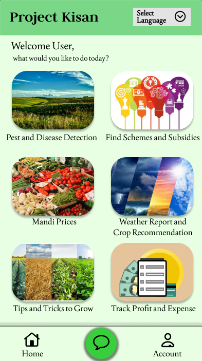
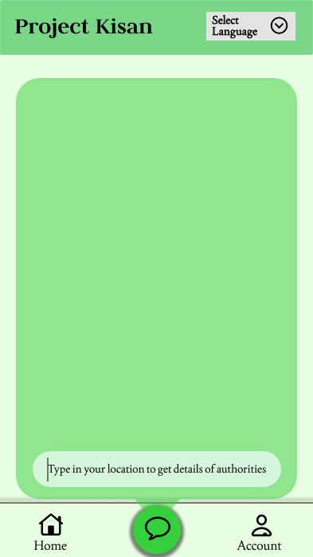

# 🌾 Project Kisan

### Empowering Farmers with AI, Data, and Local Language Accessibility

> 🚧 **UNDER DEVELOPMENT** 🚧  
> Project Kisan is currently under active development. Features, models, and implementation details are subject to change as the project evolves.

## 📖 About

Project Kisan is an AI-powered agricultural assistant designed to support farmers through intelligent recommendations, real-time insights, and accessible digital services. The platform aims to simplify agricultural decision-making by bringing together crop health analysis, market intelligence, weather information, and government support services in one place.

## ✨ Features

- 🌱 **Crop Disease Detection** – Detect crop diseases from uploaded images and receive treatment suggestions.
- 📈 **Market Price Prediction** – Analyze market trends and predict crop prices to support better selling decisions.
- 🌾 **Crop Growth Guidance** – Get recommendations and best practices for crop cultivation and yield improvement.
- 🌦️ **Weather Insights** – Access weather reports and farming suggestions based on local conditions.
- 🏛️ **Authority Support** – Connect with agricultural officials and support services when assistance is needed.
- 🌐 **Multilingual Support** – Interact with the platform in multiple regional languages for improved accessibility.

## 🎨 UI Mockups

<table>
<tr>
<td align="center">
 
<b>Home Screen</b>
</td>

<td align="center">
 
<b>Assistant & Support Screen</b>
</td>
</tr>
</table>

> *Current UI design mockups. Final implementation may differ.*

## 🤝 Contributors

- Bliss Gonsalves
- Sanika Mane
- Shravani Joshi
- Trisha Deshmukh

## ⚠️ Disclaimer

Project Kisan is currently in development. Predictions, recommendations, and outputs generated by prototype models should be considered informational and should not replace professional agricultural advice.
